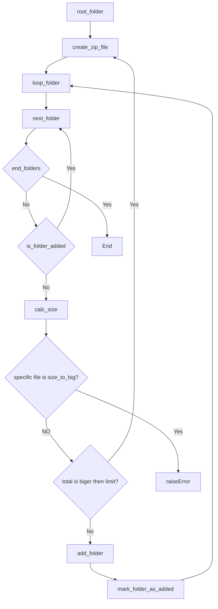

# An Algorithm.

```mermaid
flowchart

root_folder --> create_zip_file --> loop_folder --> next_folder --> end_folders{end_folders} -->|No| is_folder_added
end_folders{end_folders} -->|Yes| End 
is_folder_added{is_folder_added}  -->|Yes| next_folder
is_folder_added{is_folder_added}  -->|No| calc_size
        calc_size --> 
        checksize_to_big{specific file is size_to_big?} -->|NO| checksize{total is biger then limit?}  
        checksize_to_big{specific file is size_to_big?} -->|Yes| raiseError
        checksize{total is biger then limit?} -->|No| add_folder --> mark_folder_as_added --> loop_folder 
        checksize{total is biger then limit?} -->|Yes| create_zip_file
```